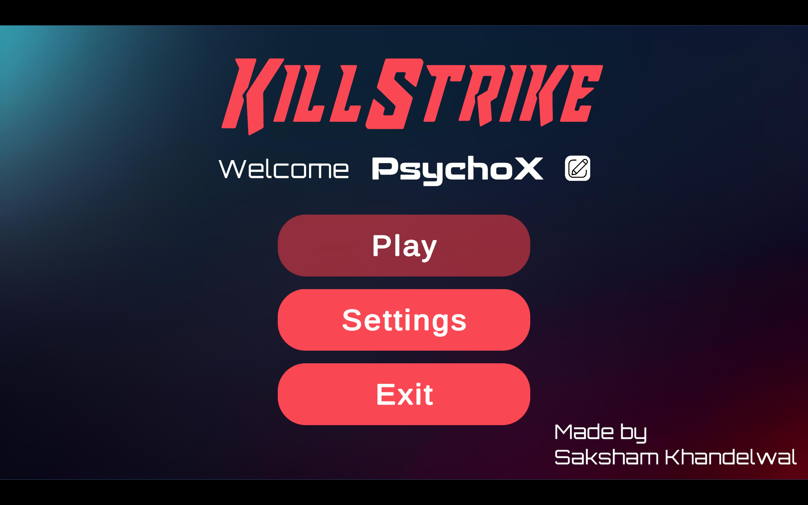
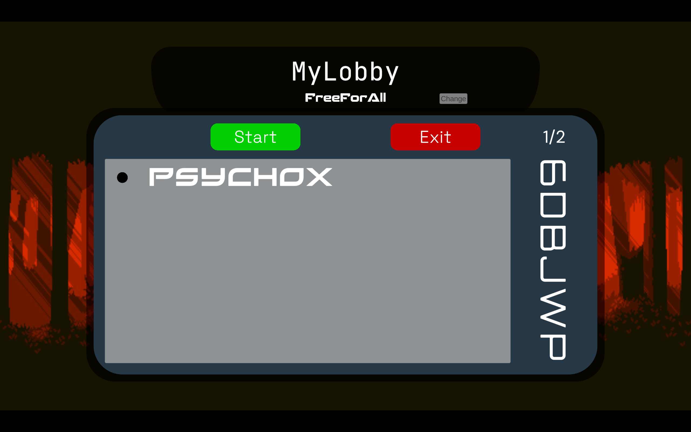
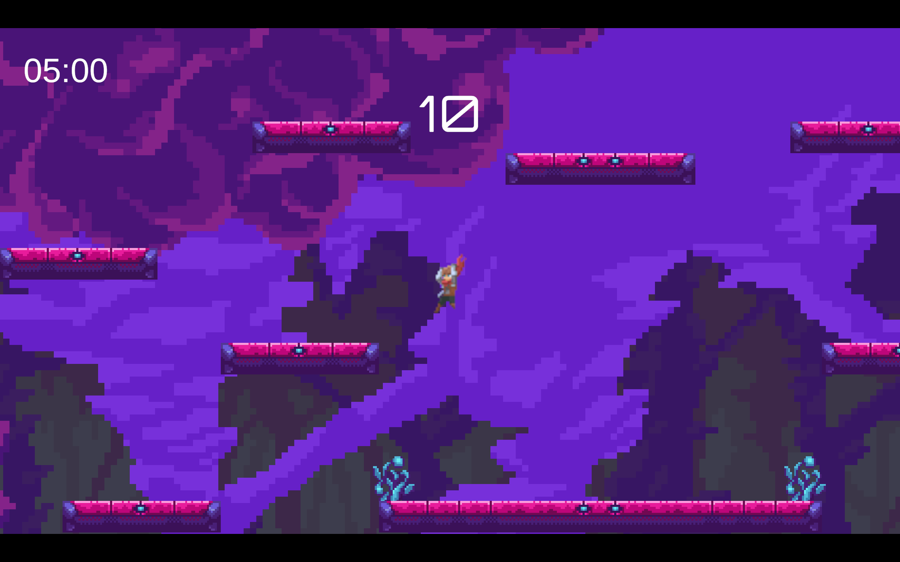
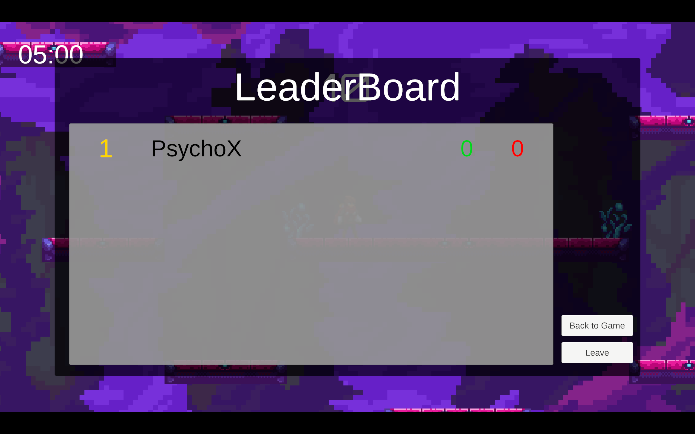

# KillStrike

## Table of Contents

1. [Project Overview](#project-overview)
2. [Repo Structure](#repo-structure)
3. [Key Features](#key-features)
4. [Technical Implementation](#technical-implementation)
5. [Learning Journey](#learning-journey)
6. [Common Multiplayer Development Challenges](#common-multiplayer-development-challenges)
7. [Future Work](#future-work)
8. [Conclusion](#conclusion)
9. [Screenshots](#screenshots)
10. [Game Controls](#game-controls)

## Project Overview 

This project is a multiplayer PvP melee combat game developed in Unity, featuring pixel art aesthetics and side-scroller gameplay. Set in a closed arena with multiple platforms, players engage in fast-paced combat using various moves including punches, kicks, dropkicks, and sword attacks. The game implements Unity's multiplayer services (Lobby, Relay) to facilitate online matchmaking and gameplay.

## Repository Structure 

This repository contain both the unity project files along with the exported build of the game.
- Preview Folder: Contains screenshot of the game
- KillStrike.rar: Compressed file for the exported game, can be played directly.
- Project Files.zip: Contains the unity project files, open the folder in the unity game engine to view them completely

## Video Link: [Final Project Video](https://drive.google.com/file/d/1jo1lKMNV_7upXnnGSoF0yc-qJwYb2Qff/view?usp=sharing)

## Key Features 

-   **Network Architecture**:
    -   Unity Lobby system for matchmaking
    -   Unity Relay for secure P2P connections
    -   Synchronized game state across all clients
-   **Game Flow**:
    -   Main menu with play, settings, and exit options (with confirmation popup)
    -   Lobby system with public/private room creation and joining
    -   Host privileges (player kicking, game initiation)
    -   10-second combat lock period after second player joins
    -   Real-time leaderboard tracking health/damage
-   **Combat Mechanics**:
    -   Diverse moveset: punches, kicks, dropkicks, sword attacks
    -   Movement options: jumping, dashing, wall climbing
    -   Health system with damage calculation
-   **Robust Systems**:
    -   Mid-game client join/leave handling
    -   Resolution and audio settings persistence
    -   Music and sound effects for all actions
    -   Dynamic camera following players
    -   Full controller support alongside keyboard input

## Technical Implementation 

**Core Packages**:

-   Unity Lobby - Matchmaking and room management
-   Unity Relay - NAT traversal for P2P connections
-   Netcode for GameObjects - Core networking framework
-   Input System - Controller and keyboard input handling
-   Cinemachine - Camera follow mechanism

## Learning Journey 

Coming from basic Pygame experience, this project represented a significant learning curve:

1. **Unity Fundamentals**:

    - Mastered Entity-Component-System architecture
    - Learned Unity physics and animation systems

2. **Multiplayer Networking**:

    - Understood client-server vs P2P architectures
    - Implemented synchronization techniques
    - Mastered RPCs and NetworkVariables

3. **Challenges Overcome**:
    - **Synchronization**: Solved jittery movements through changing queue size
    - **Relay Configuration**: Worked through NAT traversal challenges
    - **Mid-game Joins**: Developed player state caching for late joiners
    - **Camera System**: Created dynamic following with platform constraints

## Common Multiplayer Development Challenges 

1. **Network Synchronization**:

    - Keeping game state consistent across clients
    - Managing authority conflicts

2. **Latency Compensation**:

    - Implementing lag-tolerant combat systems
    - Hit registration with ping variation

3. **Session Management**:

    - Handling player disconnections gracefully
    - Implementing reconnection logic

4. **Complex Debugging**:
    - Reproducing network-specific bugs
    - Diagnosing desynchronization issues
    - Testing edge cases across multiple clients

## Future Work 

**Immediate Fixes**:

-   Optimize network bandwidth usage
-   Some sound effect related issues

**New Features**:

-   Character customization system
-   Additional maps with interactive elements
-   Special abilities and power-ups
-   In-game text and voice chat

**Technical Improvements**:

-   Implement dedicated server support
-   Add regional matchmaking
-   Develop replay system
-   Create spectator mode

**Deployment**:

-   Set up cloud-hosted matchmaking service
-   Implement player accounts and progression

## Conclusion 

This project represents a significant achievement in multiplayer game development. Starting with minimal Unity experience, I've created a complex networked combat system with robust matchmaking capabilities. Through persistent debugging and iterative development, I've gained deep understanding of Unity's multiplayer ecosystem. The project not only resulted in a functional PvP game but provided invaluable experience in system design and technical implementation that will serve as a foundation for future game development.

## Screenshots 

| **Main Menu**                      | **Lobby System**                |
| ---------------------------------- | ------------------------------- |
|  |      |
| Welcome screen with options        | Lobby interface showing players |

| **Game World**                       | **Leaderboard**                         |
| ------------------------------------ | --------------------------------------- |
|  |  |
| Platform-based combat arena          | Real-time player rankings               |

## Game Controls 

**Keyboard Controls**:

-   `A/D` or `←/→`: Move left/right
-   `S` or `↓`: Fast fall
-   `Space`: Jump
-   `Left Shift`: Dash
-   `Space` near wall: Wall jump
-   `C`: Draw Sword
-   `Z`: Punch/Sword Attack
-   `X`: Kick
-   `↓` + `X`: Dropkick
-   `Esc`: Pause menu
